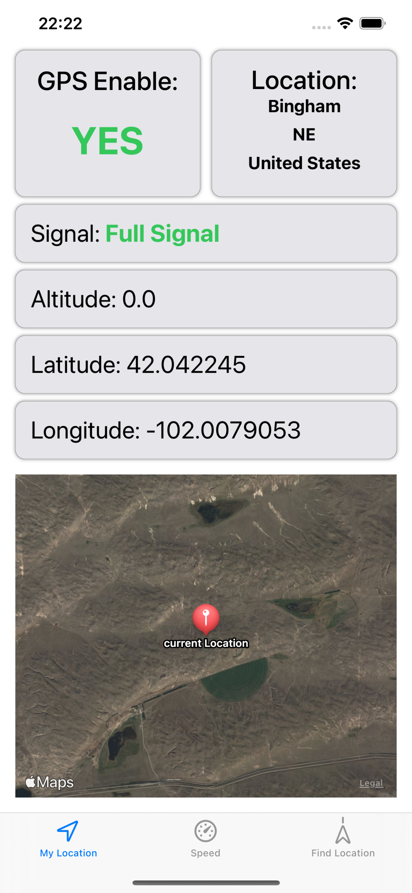
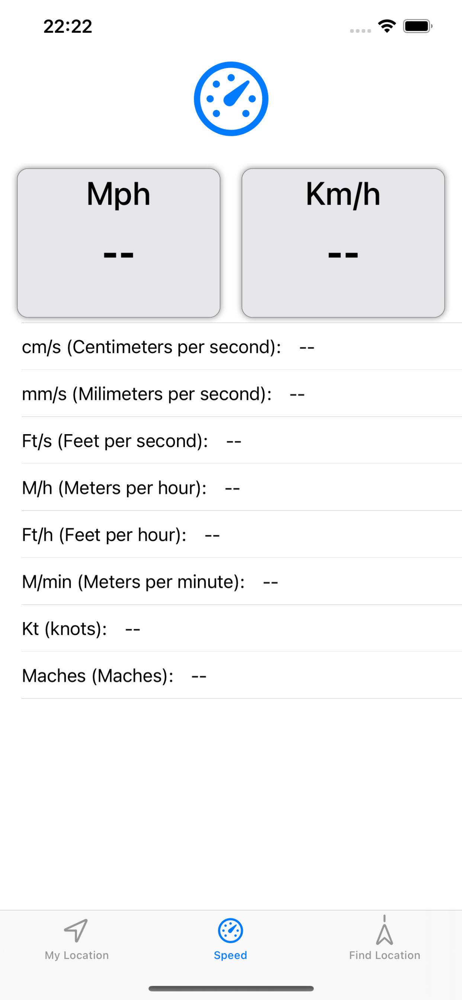
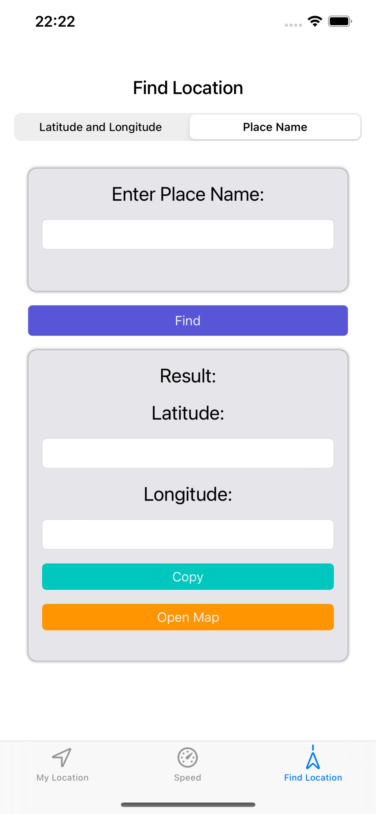
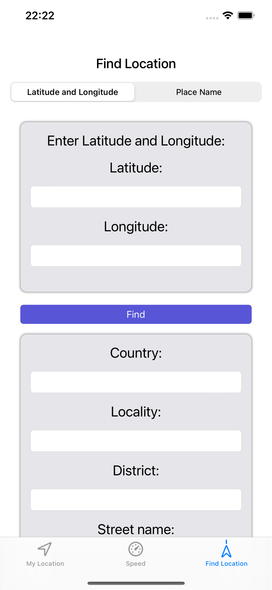

Gpsgenix
==========
An application for get Information and status GPS on the device.
you can see your location on the map, current coordinates (longitude and latitude), altitude.
You can also see the speed in several units of measure (Km/h, Mph and more units measure)
the app can show you by enter place name/Coordinates information like country, city, street name, postal code , ocean, code area and more..

## Screenshots 
  

    &nbsp;&nbsp;
  &nbsp;&nbsp;
  &nbsp;&nbsp;
   &nbsp;&nbsp;

